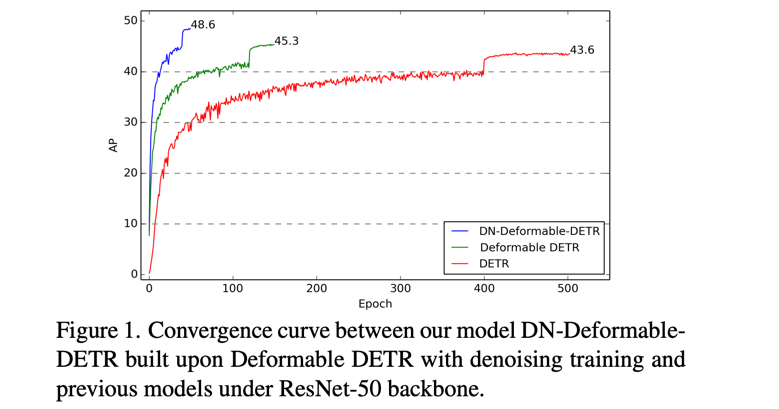
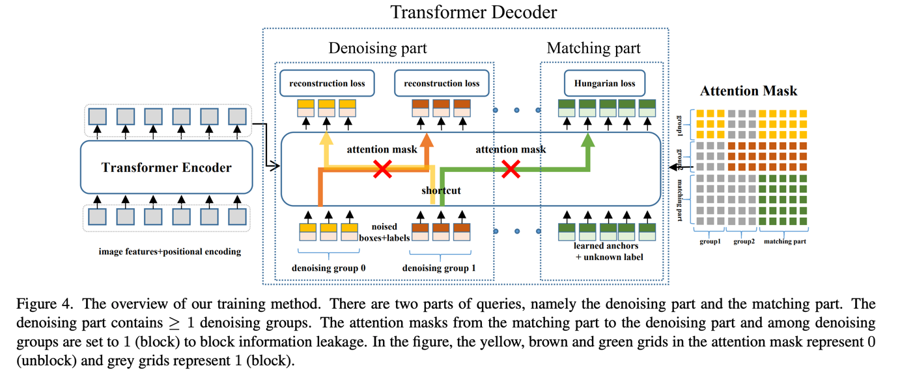
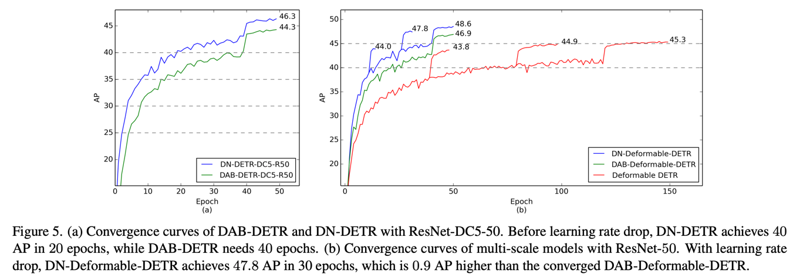

**DN-DETR**: Accelerate DETR Training by Introducing Query DeNoising
========

By [Feng Li*](https://fengli-ust.github.io/), [Hao Zhang*](https://scholar.google.com/citations?user=B8hPxMQAAAAJ&hl=zh-CN), [Shilong Liu](https://scholar.google.com/citations?hl=zh-CN&user=nkSVY3MAAAAJ), [Jian Guo](https://idea.edu.cn/en/about-team/jian_guo.html), [Lionel M.Ni](https://scholar.google.com/citations?hl=zh-CN&user=OzMYwDIAAAAJ), and [Lei Zhang](https://scholar.google.com/citations?hl=zh-CN&user=fIlGZToAAAAJ).

This repository is an official implementation of the [DN-DETR](https://arxiv.org/pdf/2203.01305.pdf). Accepted to **CVPR 2022** (score **112**, got **2 strong accept** and 1 weak accept!). Code will be avaliable soon. Stay tuned!  
[[papaer link](https://arxiv.org/pdf/2203.01305.pdf)] [[中文解读](https://www.zhihu.com/question/517340666/answer/2381304399)]

## Update 2022 March 8

We release another work [DINO:DETR with Improved DeNoising Anchor Boxes for End-to-End Object Detection](https://arxiv.org/abs/2203.03605) that for the first time establishes a DETR-like model as a SOTA model on the [leaderboard](https://paperswithcode.com/sota/object-detection-on-coco). Also based on **DN**. Code will be avaliable [here](https://github.com/IDEACVR/DINO).

## Introduction

**Abstract**: We present in this paper a novel denoising training
method to speedup DETR (DEtection TRansformer) training and offer a deepened understanding of the slow convergence issue of DETR-like methods. We show that the slow
convergence results from the instability of bipartite graph
matching which causes inconsistent optimization goals in
early training stages. To address this issue, except for the
Hungarian loss, our method additionally feeds ground-truth
bounding boxes with noises into Transformer decoder and
trains the model to reconstruct the original boxes, which
effectively reduces the bipartite graph matching difficulty
and leads to a faster convergence. Our method is universal
and can be easily plugged into any DETR-like methods by
adding dozens of lines of code to achieve a remarkable improvement. As a result, our DN-DETR results in a remarkable improvement (+**1.9**AP) under the same setting and
achieves the best result (AP **43.4** and **48.6** with 12 and 50
epochs of training respectively) among DETR-like methods
with ResNet-50 backbone. Compared with the baseline under the same setting, DN-DETR achieves comparable performance with **50%** training epochs. 

## Links
Our work is based on **DAB-DETR**. We also release another [SOAT](https://paperswithcode.com/sota/object-detection-on-coco) detection model **DINO** based on DN-DETR and DAB-DETR.   
- **DINO: DETR with Improved DeNoising Anchor Boxes for End-to-End Object Detection**.     
Hao Zhang*, Feng Li*, Shilong Liu*, Lei Zhang, Hang Su, Jun Zhu, Lionel M. Ni, Heung-Yeung Shum.  
arxiv 2022.   
[[paper]](https://arxiv.org/abs/2203.03605) [[code]](https://github.com/IDEACVR/DINO).  

- **DAB-DETR: Dynamic Anchor Boxes are Better Queries for DETR**.  
Shilong Liu, Feng Li, Hao Zhang, Xiao Yang, Xianbiao Qi, Hang Su, Jun Zhu, Lei Zhang.    
International Conference on Learning Representations (ICLR) 2022.  
[[Paper]](https://arxiv.org/abs/2201.12329)[[Code]](https://github.com/SlongLiu/DAB-DETR).     

## Bibtex
If you find our work helpful for your research, please consider citing the following BibTeX entry.   
> @article{li2022dn,  
  &emsp;&emsp;title={DN-DETR: Accelerate DETR Training by Introducing Query DeNoising},  
  &emsp;&emsp;author={Li, Feng and Zhang, Hao and Liu, Shilong and Guo, Jian and Ni, Lionel M and Zhang, Lei},  
  &emsp;&emsp;journal={arXiv preprint arXiv:2203.01305},  
  &emsp;&emsp;year={2022}   
}
